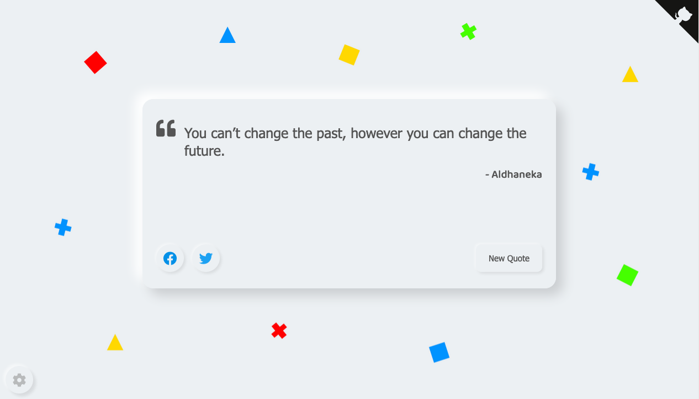

# Random-Quotes-Generator-Neumorphism-Design

JavaScript Random Quotes Generator showcases Project — With Neumorphism design, clean, and Simple 

 Random Quotes Generator without API

Designed by [Aldhaneka][Aldhaneka] — Programmed by [Aldhaneka][Aldhaneka]

  
Table of Contents

  ### Table of Contents
  ---
  - [Getting Started](#getting-started)
    - [Introduction](#introduction)
    - [Features](#features)

---

## Getting Started

<figure class="video_container">
  <iframe src="https://www.youtube.com/embed/QTN5vq0X24Q" frameborder="0" allowfullscreen="true"> </iframe>
</figure>
### Introduction
Hello There, I'm Aldhaneka. So I built random quotes generator with JavaScript, and this project is for my School Project.

This project is fill of my Quotes, not from famous people.

### Features
- Dark Mode
- Mobile Friendly
- Switch Quote Type

### Reference
Babel Package 

### Issues
Not completely responsive

---
Built with love by Aldhaneka

[Aldhaneka]: https://github.com/Aldhanekaa
